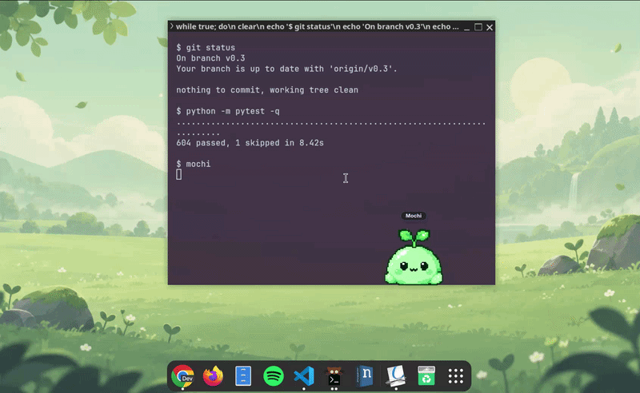

# mochi 🌱


[](https://github.com/miflow13/mochi-desktop/actions/workflows/tests.yml)


<p align="center">
  
</p>

<p align="center">
  <strong>A tiny Linux desktop buddy that lives alongside what you're already doing.</strong>
</p>

Mochi walks around, sleeps, reacts to interaction and broad desktop activity,
builds a persistent bond with you, unlocks little moods over time, and can even
sit down for a focus session with you.

The goal is not to turn your desktop into a chore list. Mochi is meant to feel
like a small character sharing the space: expressive, local, non-punitive, and
easy to ignore when you need to get things done.

[Website](https://miflow13.github.io/mochi-desktop/) ·
[Documentation](docs/README.md) ·
[Changelog](CHANGELOG.md) ·
[Report a bug](#reporting-bugs) ·
[Asset guide](assets/mochi/README.md)

> **Status:** early public alpha. Fedora + GNOME + Wayland is the primary tested
> environment. On GNOME Wayland, Mochi uses XWayland for the buddy window where
> native positioning restrictions require it.

---

## v0.3 — growing together 🌱

v0.3 is centered on one idea: **make spending time with Mochi feel meaningful
without making care feel like work.**

Bond progress does not decay. There are no streaks to maintain, no missed-day
penalties, and no punishment for closing the app. You build the relationship by
doing ordinary things together.

### Feed Mochi

<p align="center">
  
</p>

The right-click menu now includes **Feed**. Mochi plays an authored eating
animation and sound, then responds with a little heart. Feeding also participates
in the bond system.

This is intentionally a positive interaction rather than a hunger meter:
Mochi does not become sick, sad, or demanding because you have been away.

### Persistent bond progression

Mochi now has a persistent, non-decaying **Bond Level**.

Bond XP can come from shared activities such as:

- typing together,
- feeding Mochi,
- and completed Focus with Mochi time.

The current bond level and progress are visible from Mochi's controls. When a
level boundary is crossed, Mochi gets a compact celebration sequence with an
authored level-up animation, sound, visual feedback, and unlock presentation.

Some bond levels also teach Mochi new idle moods, so progression changes how the
character can behave rather than only increasing a number.

### Emote Catalogue

<p align="center">
  
</p>

The new **Emote Catalogue** gives Mochi's expressions a home.

It includes:

- bond-gated unlocks,
- rarity tiers,
- locked and coming-soon states,
- animated hover previews for implemented emotes,
- and newly learned idle moods.

Current catalogue entries include familiar interactions such as Heart, Bounce,
and Squish alongside bond unlocks such as **Side Eye** and **Table Flip**.

With the GNOME helper enabled, press:

`Ctrl + Alt + E`

to open the catalogue.

### Focus with Mochi

<p align="center">
  
</p>

**Focus with Mochi** turns Mochi into a quiet coworking/study companion without
turning him into a productivity coach.

Configure:

- **5–120 minute** focus blocks,
- **1–30 minute** breaks,
- **1–8 rounds**,
- optional sparse encouragement,
- and an optional local **Rain** soundscape with independent volume control.

Mochi thinks while you set the session up, settles into a low-energy writing
loop while you work, and returns to normal behavior during breaks.

Focused time earns **1 bond XP per completed focus minute**, and completing the
whole configured session grants a one-time **+10 XP** bonus. Pausing or stopping
early is not punished, and already-earned whole-minute XP is kept.

---

## What Mochi already does

v0.3 builds on the existing desktop-companion foundation:

- idle breathing, blinking, looking around, and autonomous walking,
- persistent **Stay put** control,
- click chirps, bounce, squish, heart, and triple-click dialogue,
- pickup, velocity-aware dragging, and drop behavior,
- sleep / wake behavior,
- typing companionship,
- terminal and coding coworking reactions,
- music and media reactions,
- edge roaming,
- nameplates and lightweight speech bubbles,
- Mochi Lab developer controls,
- and **AmbiSense**, Mochi's local contextual-awareness system.

The intent is for these behaviors to cooperate through one character/state
system rather than behave like unrelated GIF triggers.

## AmbiSense and privacy

AmbiSense is Mochi's local, rule-based awareness system.

Depending on the available desktop integrations, it can respond to signals such
as:

- anonymous typing activity,
- session presence,
- coarse application categories,
- media playback,
- power/battery changes,
- network changes,
- and file-browsing activity.

**AmbiSense is not an LLM and does not use a cloud service.**

Mochi does not collect typed characters, words, key values, typing history,
application titles, document names, or on-screen content.

See [AmbiSense documentation](docs/ambisense.md) for the event flow and privacy
model.

---

## Install

The installer has a supported dependency path for Fedora. It creates a private
Python environment, installs the GNOME helper, adds Mochi to the application
grid, and installs `mochi` and `mochi-uninstall` under `~/.local/bin`.

### Current stable checkout

```bash
git clone https://github.com/miflow13/mochi-desktop.git
cd mochi-desktop
./install.sh
```

### Test the v0.3 development branch

```bash
git clone https://github.com/miflow13/mochi-desktop.git
cd mochi-desktop
git switch v0.3
./install.sh
```

The installer installs the source currently checked out in Git.

After the first GNOME Wayland installation, log out and back in once so GNOME
can load Mochi's optional awareness helper. Mochi still runs without the helper,
but some contextual reactions and global shortcuts will be unavailable.

### Update an installed copy

Quit Mochi first, then:

```bash
git pull --ff-only
./install.sh
```

Relaunch afterward. `git pull` alone does not update the app-grid installation,
and an already-running process keeps its loaded code.

### Fedora with Niri

Niri support is experimental. After an update, rerun the installer and reset
Mochi's saved position before launching:

```bash
./install.sh
mochi --reset-position
```

---

## Controls

Launch Mochi from the application grid or run:

```bash
mochi
```

If `~/.local/bin` is not on `PATH`, use `~/.local/bin/mochi`.

| Interaction | What it does |
| --- | --- |
| Left-click | Chirp + tactile reaction |
| Double-click | Heart emote |
| Three quick clicks | Short playful dialogue |
| Drag | Pick up and reposition Mochi |
| Right-click | Bond, Feed, Focus, size/audio, sleep/wake, movement, and app controls |
| `Ctrl + Alt + E` | Open the Emote Catalogue |
| `Ctrl + Alt + Shift + M` | Open Mochi Lab developer controls |

Global shortcuts require the GNOME helper.

---

## Compatibility

- **Primary target:** Fedora + GNOME + Wayland.
- Mochi uses an XWayland GTK window on GNOME Wayland for reliable desktop
  positioning.
- Other distributions may work, but automatic dependency installation currently
  supports Fedora.
- GNOME provides the fullest AmbiSense integration.
- Niri, fractional scaling, multi-monitor setups, and non-GNOME environments
  receive less regression coverage.

### Known issues

- **Workspace / Overview freeze — [#45](https://github.com/miflow13/mochi-desktop/issues/45):**
  entering GNOME Overview or switching workspaces during an emote can leave
  Mochi visually frozen on XWayland.
- **Drag reversal responsiveness — [#68](https://github.com/miflow13/mochi-desktop/issues/68):**
  drag-left/right poses can lag briefly after rapidly reversing direction.
- Alpha behavior and compatibility can still change.

Passing automated tests does not establish reliability across every compositor,
monitor layout, scaling setup, or desktop session. Real Fedora/GNOME QA remains
part of Mochi's release process.

### Helper and placement checks

If contextual reactions or global shortcuts do not work, check the helper and
log out/in once:

```bash
gnome-extensions info mochi-typing@miflow13
gnome-extensions enable mochi-typing@miflow13
```

Use `mochi --reset-position` to forget saved placement and `mochi --debug` for
diagnostic logging.

More detailed recovery steps are in
[Getting Started](docs/wiki/Getting-Started.md) and
[Troubleshooting and Regressions](docs/wiki/Troubleshooting-and-Regressions.md).

---

## Development

Complete the Fedora runtime/helper installation first, then use a separate
editable environment:

```bash
git clone https://github.com/miflow13/mochi-desktop.git
cd mochi-desktop
python3 -m venv --system-site-packages .venv
source .venv/bin/activate
python -m pip install -e .
python -m pip install pytest
python -m pytest
mochi --debug
```

See [CONTRIBUTING.md](CONTRIBUTING.md),
[REGRESSION_WATCHLIST.md](REGRESSION_WATCHLIST.md), and the
[documentation index](docs/README.md) for contribution and verification
guidance.

## Reporting bugs

[Open a bug report](https://github.com/miflow13/mochi-desktop/issues/new?template=bug_report.md)
with the shortest reproduction steps, expected and actual behavior, Linux and
GNOME/compositor versions, Wayland/X11 session type, and monitor layout/scaling.

Include the tested branch/commit or release tag, how Mochi was installed/launched,
and whether it was reinstalled and restarted after updating.

For logs:

```bash
mochi --debug
```

Check [existing issues](https://github.com/miflow13/mochi-desktop/issues) first.

## Uninstall

```bash
mochi-uninstall
```

To remove saved settings too:

```bash
mochi-uninstall --purge
```

## Support Mochi ☕

Mochi is free and open source. If you enjoy having this little desktop buddy
around and want to support continued development:

[](https://ko-fi.com/mikachew)

---

Mochi is released under the [MIT License](LICENSE).
