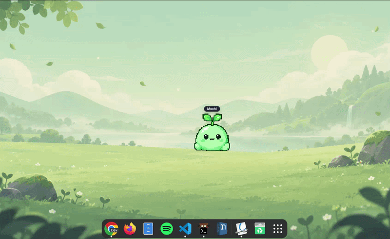
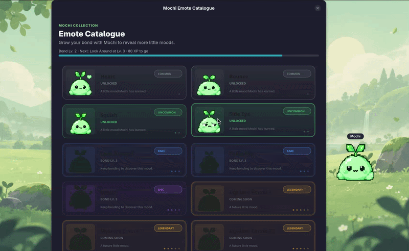
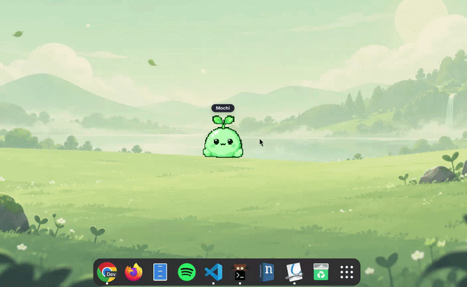

<div align="center">

# mochi 🌱

**v0.3 · Growing Together**

### A tiny Linux desktop buddy that grows with you.


Seeing Mochi pop up in the Linux community has been surreal. 💚

[](https://www.youtube.com/watch?v=fCe5UqQBj9I)

> A community-made look at Mochi.  
> **Watch on YouTube →**


Mochi lives quietly on your Linux desktop — wandering, reacting, working beside
you, taking naps, sharing snacks, learning new emotes, and building a bond
through the time you naturally spend together.

**No streaks · No decay · No cloud AI · Just a little guy 🌱**

[Website](https://miflow13.github.io/mochi-desktop/) ·
[Install](#install) ·
[Documentation](docs/README.md) ·
[Artist Kit](artist-kit/README.md) ·
[Contributing](CONTRIBUTING.md) ·
[Changelog](CHANGELOG.md) ·
[Report a bug](#reporting-bugs)

<br>


[](https://github.com/miflow13/mochi-desktop/actions/workflows/tests.yml)


</div>

> **Early public alpha.** Fedora + GNOME + Wayland remains Mochi's primary
> tested environment. On GNOME Wayland, Mochi uses XWayland for the buddy window
> where native positioning restrictions require it.
>
> **Portability update:** installation should now behave much better across
> different Linux setups. GNOME-only integration is optional, non-GNOME desktops
> can skip the awareness helper cleanly, missing GNOME extension tooling no
> longer blocks installation, and Mochi's private Python environment can
> bootstrap the build backend it needs instead of relying on Fedora-specific
> Python build packages. **CachyOS + Umbriel + Wayland** has also been
> community-verified.

## ✨ What's new lately

- 🌍 **Broader Linux portability** — safer installs across GNOME and non-GNOME
  desktops, with behavioral installer regression coverage for the new paths.
- 🎨 **Mochi Artist Kit** — the master reference, animation guide, workspace
  template, and contribution path are now available for community-made emotes.
- 🧰 **Deskling SDK work is underway** — Mochi's reusable animation, state,
  interaction, and desktop-companion pieces are being extracted into a separate SDK.
- 🔥 **More personality** — new catalogue and ambient behaviors continue to land,
  including the rare **This Is Fine** emote.
- 🪟 **Desktop behavior has been hardened** — recent fixes improve workspace
  stickiness, focus handling, and installer rollback safety during updates.

---


<div align="center">

## 🧰 Build your own Deskling


**A reusable Deskling SDK is in development.**

Mochi is the first Deskling, but the goal is not for Mochi to be the only one.

The planned **Deskling SDK** is being designed to let developers bring their own
character, artwork, animations, and behavior into a reusable Linux
desktop-companion runtime — without having to fork Mochi and untangle
Mochi-specific code first.

[](https://github.com/miflow13/Deskling-SDK)

</div>

The SDK work is focused on extracting the reusable pieces behind Mochi:
animation playback, coherent state/lifecycle handling, desktop interactions,
window placement, configuration, and hooks for contextual behavior.

This is still early work. APIs, packaging, and the extension surface may change
before the first public SDK release.

**[Follow Deskling SDK development →](https://github.com/miflow13/Deskling-SDK)**

---

## 🎨 Make something for Mochi

**Mochi's master reference, shipped animation library, and animation design guide are open for artists to use.**

You do not need to be a programmer to contribute an emote or animation. The **Mochi Artist Kit** documents the character rules, 256 × 256 runtime canvas, bottom-center anchoring, nearest-neighbor export rules, animation/state conventions, submission format, and the exact production assets used by Mochi.

**[Open the Mochi Artist Kit →](artist-kit/README.md)**

Want to make Mochi wave differently, react to something new, perform an absurd Linux joke, or invent an entirely new emote? Start with the canonical master, draw the frames, and share it with the project. 💚

---

## v0.3 — Growing Together 🌱

v0.3 is centered on one idea:


> **Make spending time with Mochi feel meaningful without making care feel like work.**

Mochi is not a productivity dashboard wearing a cute face. He is meant to feel
like a small character sharing your desktop: expressive, local, non-punitive,
and easy to ignore when you need to get things done.

### Share a snack

<p align="center">
  
</p>

The right-click menu now includes **Feed**. Mochi plays an authored eating
animation and sound, then responds with a little heart. Feeding also participates
in the bond system.

There is no hunger meter and no punishment for being away. Feeding is a cute
interaction, not an obligation.

### Progress without punishment

Mochi has a persistent, non-decaying **Bond Level**. Bond XP comes from ordinary
shared activity, including:

- typing together,
- feeding Mochi,
- and completed Focus with Mochi time.

There are **no streaks to maintain, no missed-day penalties, and no decay**.
Bond records time spent together instead of turning Mochi into another thing
you have to maintain.

The current bond level and progress are visible from Mochi's controls. When a
level boundary is crossed, Mochi gets a compact celebration sequence with an
authored level-up animation, sound, visual feedback, and unlock presentation.

### He learns new tricks

<p align="center">
  
</p>

The **Emote Catalogue** gives Mochi's expressions a home.

It includes:

- bond-gated unlocks,
- rarity tiers,
- locked states,
- animated hover previews,
- and newly learned behaviors that can join Mochi's ambient animation pool.

Current catalogue entries include **Heart, Bounce, Squish, Wave, Coffee, Side Eye,
Look Around, Table Flip, VS Code, Dance, and Mochi.exe**.

With the GNOME helper enabled, press:

`Ctrl + Alt + E`

to open the catalogue.

### Work beside each other

<p align="center">
  
</p>

**Focus with Mochi** turns Mochi into a quiet coworking/study companion without
turning him into a productivity coach.

Configure:

- **5–120 minute** focus blocks,
- **1–30 minute** breaks,
- **1–8 rounds**,
- optional sparse encouragement,
- and an optional local **Rain** soundscape with independent volume control.

Mochi thinks while you set the session up, settles into a low-energy writing
loop while you work, and returns to normal behavior during breaks.

Focused time earns **1 bond XP per completed focus minute**, and completing the
whole configured session grants a one-time **+10 XP** bonus. Pausing or stopping
early is not punished, and already-earned whole-minute XP is kept.

---

## Lives alongside your desktop

v0.3 builds on the existing desktop-companion foundation:

- a calm static idle with natural blinking, looking around, and occasional autonomous walking,
- a small startup hello plus unlocked catalogue emotes joining Mochi's ambient behavior,
- persistent **Stay put** and optional edge-roaming controls,
- click chirps, bounce, squish, heart, and triple-click dialogue,
- pickup, velocity-aware dragging, and drop behavior,
- manual sleep / wake plus occasional autonomous naps,
- typing companionship,
- terminal and coding coworking reactions,
- music and media reactions,
- edge roaming,
- lightweight speech and an ephemeral nameplate,
- Mochi Lab developer controls,
- and **AmbiSense**, Mochi's local contextual-awareness system.

The goal is for these behaviors to cooperate through one character and state
system rather than feel like unrelated GIF triggers.

## Ambient Behaviors

**AmbiSense** is Mochi's local, rule-based awareness system.

Depending on the available desktop integrations, it can respond to broad signals
such as:

- anonymous typing activity,
- session presence,
- coarse application categories,
- media playback,
- power/battery changes,
- network changes,
- and file-browsing activity.

**AmbiSense is not an LLM and does not use a cloud service.**

Mochi does not collect typed characters, words, key values, typing history,
application titles, document names, or on-screen content.

See [AmbiSense documentation](docs/ambisense.md) for the event flow and privacy
model.

---

## Install

### Give Mochi a corner of your desktop

The installer has a supported dependency path for Fedora. It creates a private
Python environment, adds Mochi to the application grid, and installs `mochi`
and `mochi-uninstall` under `~/.local/bin`. On GNOME, it also installs the
optional awareness helper when GNOME extension tooling is available.

### Install from source

```bash
git clone https://github.com/miflow13/mochi-desktop.git
cd mochi-desktop
./install.sh
```

`main` currently tracks the v0.3 alpha line. The installer installs the source
from the commit or branch you currently have checked out.

If the installer says it installed Mochi's optional GNOME awareness helper,
log out and back in once so GNOME can load it. If the helper was skipped,
Mochi still runs without it, but some contextual reactions and global
shortcuts will be unavailable.

### Update an installed copy

Quit Mochi first, then update a clean source checkout:

```bash
git switch main
git pull --ff-only origin main
./install.sh
```

Relaunch afterward. `git pull` alone does not update the app-grid installation,
and an already-running process keeps its loaded code. If you have local commits
or uncommitted changes, preserve them on a branch or stash them before syncing
`main`.

### Fedora with Niri

Niri support is experimental. After an update, rerun the installer and reset
Mochi's saved position before launching:

```bash
./install.sh
mochi --reset-position
```

---

## Controls

Launch Mochi from the application grid or run:

```bash
mochi
```

If `~/.local/bin` is not on `PATH`, use `~/.local/bin/mochi`.

| Interaction | What it does |
| --- | --- |
| Left-click | Chirp + tactile reaction |
| Double-click | Heart emote |
| Three quick clicks | Short playful dialogue |
| Drag | Pick up and reposition Mochi |
| Right-click | Bond, Feed, Focus, size/audio, sleep/wake, movement, and app controls |
| `Ctrl + Alt + E` | Open the Emote Catalogue |
| `Ctrl + Alt + Shift + M` | Open Mochi Lab developer controls |

Global shortcuts require the GNOME helper.

---

## Compatibility

- **Primary target:** Fedora + GNOME + Wayland.
- **Community verified:** CachyOS + Umbriel + Wayland — installation and runtime
  confirmed working by the reporter of [#125](https://github.com/miflow13/mochi-desktop/issues/125)
  after the portability fixes in [#126](https://github.com/miflow13/mochi-desktop/pull/126).
- Mochi uses an XWayland GTK window on GNOME Wayland for reliable desktop
  positioning.
- Other distributions may work, but automatic dependency installation currently
  supports Fedora. Mochi's installer no longer requires Fedora's Python build
  packages to provide the local setuptools build backend.
- GNOME provides the fullest AmbiSense integration. On non-GNOME desktops, the
  optional GNOME helper is skipped instead of blocking installation.
- Niri, fractional scaling, multi-monitor setups, and non-GNOME environments
  receive less regression coverage.

### Known issues

- **XWayland lifecycle freeze — [#45](https://github.com/miflow13/mochi-desktop/issues/45):**
  a separate freeze can still occur when entering GNOME Overview or switching
  workspaces during some animations. The ordinary sticky-workspace/focus issue
  reported in #118 has been fixed.
- Alpha behavior and compatibility can still change.

Passing automated tests does not establish reliability across every compositor,
monitor layout, scaling setup, or desktop session. Real Fedora/GNOME QA remains
part of Mochi's release process.

### Helper and placement checks

If contextual reactions or global shortcuts do not work, check the helper and
log out/in once:

```bash
gnome-extensions info mochi-typing@miflow13
gnome-extensions enable mochi-typing@miflow13
```

Use `mochi --reset-position` to forget saved placement and `mochi --debug` for
diagnostic logging.

More detailed recovery steps are in
[Getting Started](docs/wiki/Getting-Started.md) and
[Troubleshooting and Regressions](docs/wiki/Troubleshooting-and-Regressions.md).

---

## Built for Linux

`Python` · `GTK4` · `PyGObject` · `Cairo` · `GNOME Shell` · `D-Bus` · `Wayland` · `XWayland`

## Development

Complete the Fedora runtime/helper installation first, then use a separate
editable environment for development:

```bash
git clone https://github.com/miflow13/mochi-desktop.git
cd mochi-desktop
python3 -m venv --system-site-packages .venv
source .venv/bin/activate
python3 -m pip install -e .
python3 -m pip install pytest
python3 -m pytest -q
mochi --debug
```

New contributors should start with the
[Codebase Manual](docs/CODEBASE_MANUAL.md), then review
[CONTRIBUTING.md](CONTRIBUTING.md),
[REGRESSION_WATCHLIST.md](REGRESSION_WATCHLIST.md), and the
[documentation index](docs/README.md) before changing runtime behavior.

## Reporting bugs

[Open a bug report](https://github.com/miflow13/mochi-desktop/issues/new?template=bug_report.md)
with the shortest reproduction steps, expected and actual behavior, Linux and
GNOME/compositor versions, Wayland/X11 session type, and monitor layout/scaling.

Include the tested branch/commit or release tag, how Mochi was installed/launched,
and whether it was reinstalled and restarted after updating.

For logs:

```bash
mochi --debug
```

Check [existing issues](https://github.com/miflow13/mochi-desktop/issues) first.

## Uninstall

```bash
mochi-uninstall
```

To remove saved settings too:

```bash
mochi-uninstall --purge
```

## Support Mochi ☕

Mochi is free and open source. If you enjoy having this little desktop buddy
around and want to support continued development:

[](https://ko-fi.com/mikachew)

---

<div align="center">

**A few pixels. A little personality.**

Growing together, one tiny interaction at a time. 🌱

Mochi is released under the [MIT License](LICENSE).

</div>
