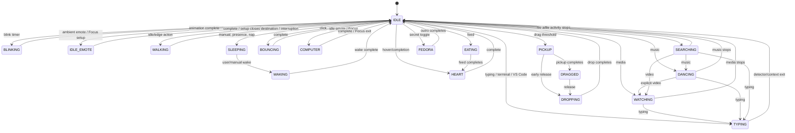

# Mochi State-Machine Audit

Audit baseline: `origin/main` at `2753736` (2026-09-23).

This audit follows behavior from detector or input, through
`Buddy._transition_to()`, `BehaviorStateController`, `behavior.can_transition()`,
and `StateMachine`, then through animation and recovery. It treats behavior,
presentation, and animation as related but separate domains.

## 1. Architecture summary

Mochi has one authoritative behavior record: `StateMachine.current`. Production
features request changes through `Buddy._transition_to()`, which delegates to
`BehaviorStateController.request()` and the shared priority policy in
`behavior.can_transition()`. No production feature writes `state.current`
directly or calls `StateMachine.transition_to()` directly.

`StateMachine.presentation` is a separate overlay owner. `NORMAL`, `LEVEL_UP`,
and `EMOTE_UNLOCK` gate speech and bond presentation without replacing the
behavior state. An active Focus session is similarly a domain session, not a
behavior state: its visual claim uses `COMPUTER` (working) or `IDLE_EMOTE`
(setup/thinking), while the Focus timer remains independently authoritative.

`AnimationPlayer` owns frame advancement. `Buddy` records the semantic animation
name, the exact active `Animation` object, and an optional pending animation.
Completion is protected by identity: a callback for an animation that is no
longer `_active_animation` is ignored. Feature mixins extend that completion
chain for terminal, Focus, Fedora, feeding, and idle-look phases.

Detectors own facts, not presentation: typing activity, YouTube/browser media,
music/MPRIS, file activity, user presence, and focused app category call into
behavior entry points. The production class composes these policies through the
`PresenceBuddy` MRO in `presence/click_dialogue.py`. Contextual recovery resolves
in this effective order:

```text
Focus work/setup
  -> Fedora hold/outro
  -> terminal coworking
  -> VS Code coworking
  -> explicit video / watching
  -> recognized music / dancing
  -> file activity / searching
  -> idle timers
```

Animation is not always a state. `idle`, mood variants, and the low-priority
`look` animation can all render while behavior remains `IDLE`; terminal and VS
Code presentations share `TYPING`; Focus work shares `COMPUTER`.

## 2. State inventory

| State | Entry | Owner | Animation(s) | Kind | Normal exit | Interruptible by | Recovery |
|---|---|---|---|---|---|---|---|
| `IDLE` | Startup; completion/recovery | Buddy | `idle` and mood idle; low-priority `look` | Loop/base | Any accepted trigger | All accepted behavior | Re-evaluate Focus/context, then timers |
| `BLINKING` | Blink timer while standing idle | Buddy blink scheduler | `blink` | One-shot | Blink completion | Higher-priority state/animation replacement | Resume exact idle frame/time, then context |
| `BOUNCING` | Accepted primary click | Buddy click buffer | `bounce` | One-shot | Completion | Sleep, pickup, feed, higher policy | Queued click once, else context/idle |
| `SQUISHING` | Preview/legacy state; not selected by production clicks | Buddy | `squish` | One-shot | Completion | Same as bounce | Context/idle |
| `EXCITED` | Preview or an explicit reaction caller | Buddy | `excited` | One-shot | Completion | Sleep, pickup, feed | Context/idle |
| `IDLE_EMOTE` | Autonomous catalogue emote; Focus setup | Buddy / Focus | finite catalogue emote; `thinking_*` | Temporary or phased loop | Completion / Focus setup closes | Context, direct input, sleep | Focus/context/idle |
| `WALKING` | Idle action, developer walk, edge roam | Buddy / EdgeRoam | `walk`, `walk_left` | Time-bounded movement | Destination reached | Click, menu, sleep, pickup, context | Save position, context/idle |
| `SLEEPING` | Manual sleep, presence idle, autonomous nap | Buddy / presence / AutonomousSleepController | `sleep` -> `sleeping` | Intro then loop | Valid wake | Wake only; menu itself is non-waking | `WAKING`, then live context/idle |
| `WAKING` | User active or manual wake from sleeping | Buddy | `wake` | One-shot | Completion | Pickup may currently pre-empt it | Live typing/context/Focus, else idle |
| `HEART` | Hover, developer action, post-feed/completion | Buddy | `heart` | One-shot | Completion | Sleep, pickup, feed | Context/Focus/idle |
| `EATING` | Deferred Feed menu action | FeedMochiMixin | `eat` | One-shot | Completed feed -> heart | Only replacement outside normal policy | Heart, then context/Focus/idle |
| `COMPUTER` | Idle laptop emote; active Focus work | Buddy / Focus | `computer`; `writing_start/loop/exit` | One-shot or phased loop | Completion / Focus pause-stop-phase | Feed, pickup, sleep; Focus remains a session | Focus if active, else context/idle |
| `TYPING` | Typing detector; terminal or VS Code focus | Ambient / terminal / presence | `typing_intro/loop/outro`; `terminal_*` | Phased contextual | Detector stop or context exit | Video, feed, pickup, sleep | Current app context, media/music/files, idle |
| `WATCHING` | YouTube/explicit video or browser fallback | MediaActivityMonitor | `watch` | Context loop | Media/focus stop | Typing, feed, pickup, sleep | Cowork, music, files, idle |
| `DANCING` | Recognized music/MPRIS | MusicDanceMixin | `dance` | Context loop | Playback stop/pause | Explicit video, typing, feed, pickup, sleep | Video/cowork/files/idle |
| `SEARCHING` | File browsing/download activity | AmbientActivityController | `searching` | Context loop | File activity stop | Video, music, typing, feed, pickup, sleep | Higher live context or idle |
| `PICKUP` | Drag threshold crossed | Buddy pointer lifecycle | `pickup` | One-shot/held transition | Pickup completes or release | Drag/drop only by policy | `DRAGGED` or `DROPPING` |
| `DRAGGED` | Pickup completes while drag remains active | Buddy pointer lifecycle | drag pose / `sway_idle` | Held | Pointer release/drag-end | Drop only by policy | `DROPPING` |
| `DROPPING` | Release/drag-end from pickup or dragged | Buddy pointer lifecycle | `drop` | One-shot | Completion | New pickup | Fedora/Focus/context/idle |
| `FEDORA` | Six-click secret toggle | FedoraModeMixin | `fedora_intro/loop/outro` | Explicit held mode | Six-click toggle and outro | Drag may temporarily own behavior | Fedora loop/outro, then context/idle |

Long-lived state-local work is mostly detector-owned rather than state-owned.
Typing has an inactivity timeout and optional bond-XP timer; contextual media,
music, and file monitors poll independently; Focus owns its timer and ambience;
sleep may have an autonomous wake timer. Every completion path must therefore
validate both current state and the live domain fact before presenting recovery.

## 3. Transition map



The diagram shows semantic edges, not every presentation phase. On recovery,
`IDLE` is generally a short arbitration point: the composed
`_maybe_resume_ambient_activity()` may immediately reclaim Focus, Fedora,
terminal/VS Code, video, music, or file activity.

## 4. Findings

No confirmed Critical or High defect was found in the audited baseline.

### Medium — production blink did not own `BLINKING` (fixed in this branch)

- Affected: `src/mochi/buddy.py`, `tests/test_buddy.py`.
- Behavior: the player rendered `blink` while `StateMachine.current` remained
  `IDLE`. `BLINKING` was entered only by animation-preview code.
- Reproduction: allow `_try_blink()` to fire from standing idle; inspect
  `_current_animation == "blink"` and `state.current == IDLE`.
- Cause: `_play_blink()` bypassed `_transition_to()` and `_resume_idle()` did not
  restore semantic state.
- Fix: claim `BLINKING` before playback and transition back to `IDLE` when the
  exact idle visual resumes.
- Regression test: `BuddyBlinkTests::test_blink_owns_behavior_state_until_idle_visual_resumes`.

### Medium — core Buddy sources and monitors have no shutdown owner

- Affected: `src/mochi/buddy.py`, `src/mochi/app.py`,
  `src/mochi/presence/integration.py`.
- Behavior: application shutdown calls the mixin chain's `shutdown_presence()`.
  That chain removes Focus/presence/feature sources, but the base Buddy has no
  terminal shutdown method. Its 16 ms tick source is not stored, and the
  idle-action, blink, computer-idle, hover-heart timers plus typing, presence,
  media, file, and developer-shortcut monitors are not stopped there.
- Reproduction: construct a production Buddy, call `shutdown_presence()`, and
  observe that the core source IDs/monitor availability remain live until GTK
  process teardown.
- Cause: lifecycle ownership grew in the presence mixins while the original
  Buddy assumed process exit would dispose all base resources.
- Recommended fix: add an idempotent `Buddy.shutdown()` that stores/removes the
  tick and base timer IDs, stops every base monitor, clears pending callbacks,
  and is called after the existing presence chain from `MochiApplication.do_shutdown()`.
- Regression test: one shutdown test asserting every base source is removed,
  every monitor is stopped exactly once, repeat shutdown is harmless, and no
  callback changes state afterward.

Risk is bounded in the normal executable because GTK exits immediately, but the
ownership contract is incomplete and fragile for restart, embedding, tests, or
future multi-window use.

### Low — `IDLE` is a universal policy escape hatch

- Affected: `src/mochi/behavior.py`.
- Behavior: `can_transition(current, IDLE)` returns true before pickup, drag,
  drop, sleep, wake, or Fedora locks are evaluated. A stale or insufficiently
  guarded callback can therefore release any owner.
- Reproduction: `can_transition(DRAGGED, IDLE)`,
  `can_transition(SLEEPING, IDLE)`, and `can_transition(FEDORA, IDLE)` all return
  true.
- Cause: recovery was made simple by treating idle as universally safe; safety
  currently depends on every caller checking its ownership first.
- Recommended fix: do not change policy globally without a transition-matrix
  design pass. First introduce owner-specific completion helpers or guarded
  release requests, then restrict illegal high-priority `-> IDLE` edges.
- Regression test: parameterized matrix proving stale completions cannot release
  `PICKUP`, `DRAGGED`, `DROPPING`, `SLEEPING`, `WAKING`, or held `FEDORA`.

### Low — contextual ownership is encoded by state plus parallel flags

- Affected: `presence/integration.py`, `presence/terminal_cowork.py`,
  `presence/focus_session.py`, `presence/fedora_mode.py`, and
  `presence/idle_look.py`.
- Behavior: `TYPING` may mean generic typing, terminal coworking, or VS Code
  coworking; `COMPUTER` may mean the idle laptop reaction or Focus work. The
  distinction lives in app-category facts, session objects, animation names,
  and flags such as `_terminal_coworking_active`, `_vscode_coworking_active`,
  `_fedora_mode_active/_exiting`, and `_idle_look_active`.
- Reproduction: trace terminal -> VS Code, Focus -> drag -> drop, or Fedora ->
  drag -> drop; correct recovery requires several independent values to agree.
- Cause: later contextual features correctly reused the small public state enum,
  but presentation-phase ownership accumulated around it.
- Recommended fix: retain the existing architecture, but centralize recovery
  queries and document each flag's sole writer/clearer. Do not add another state
  machine or expand `MochiState` merely to name animation phases.
- Regression test: production-MRO scenario tests for direct context switching,
  detector loss during interruption, and recovery after every direct action.

## 5. Ownership conflicts

| Competitors | Current arbitration | Residual risk |
|---|---|---|
| Blink/idle-look/idle timers vs contextual state | Entry checks require standing idle; transition or `_play_animation()` cancels idle look | Base timers remain scheduled and retry; shutdown is incomplete |
| Typing vs terminal/VS Code | Same `TYPING` state; focused app and cowork flags decide the art and whether typing-stop is ignored | State alone cannot identify the owner |
| Video vs music vs files | Composed resume priority and explicit hand-off code | Priority is repeated across several overrides |
| Focus session vs temporary visuals | Session remains authoritative; `COMPUTER`/`IDLE_EMOTE` are reacquired after interaction | Requires Focus checks to run first in the MRO |
| Fedora vs drag/direct input | Fedora flags persist while pointer states temporarily own behavior | Two booleans plus state/animation must remain synchronized |
| Sleep vs active Focus/media/music | Focus defers auto-sleep; music/video defer presence sleep; manual sleep may pause Focus | Wake must re-arbitrate live domains rather than force lasting idle |
| Behavior vs level-up/unlock presentation | Separate `PresentationState`; overlays gate speech and chain their own teardown | Shutdown and stale overlay callbacks require strict source cleanup |

The production MRO is part of the behavior contract. Reordering mixins can
silently reorder recovery priority even when every individual method still
passes unit tests.

## 6. Timer and callback lifecycle

| Source/owner | Lifetime and teardown assessment |
|---|---|
| Buddy 16 ms animation tick | Process-long; source ID is not stored. **Gap.** |
| Idle action, blink, computer-idle, hover-heart | Self-rescheduling or one-shot base timers. Locally de-duplicated, but not removed by shutdown. **Gap.** |
| Typing inactivity timer/backend | Reset safely during interactions; monitor exposes idempotent `stop()`, but Buddy shutdown does not call it. **Gap.** |
| Presence idle watches | Backend exposes `stop()` and owns GNOME watch IDs; not stopped by base shutdown. **Gap.** |
| Media/music/file pollers | Store one source ID and remove it in `stop()`; music mixin stops its monitor, base media/file monitors are omitted. **Partial.** |
| Autonomous sleep nap/wake | Both IDs stored; ownership flag prevents waking externally owned sleep; stopped by presence shutdown. **Safe.** |
| Terminal and VS Code debounce | Cancel-before-reschedule; removed in shutdown chain. **Safe.** |
| Focus timer and rain ambience | One timer; settled, removed, audio stopped, XP persisted on shutdown. **Safe by tests.** |
| Startup greeting/wave and presence evaluation | IDs stored, generation/state checks applied, removed on shutdown. **Safe.** |
| Idle look | One source; cancel/reschedule guarded; removed on shutdown. **Safe.** |
| Feed sound/completion | Frame-edge based, not a timer; active-animation identity and `EATING` guard reject stale completion. **Safe.** |
| Animation completion | Exact `Animation` object identity prevents a replaced animation's completion from acting. **Safe.** |
| Menu deferred action | Popover close -> `GLib.idle_add` -> dispatch; pending slot cleared before execution. Shutdown cancellation is not explicit but process exit bounds it. **Partial.** |
| Menu/focus/bubble/overlay positioning and fades | Most use serials and/or stored source IDs; feature shutdown chains remove long-running sources. Short untracked one-shots rely on serial/state checks. **Acceptable, retain tests.** |

## 7. Missing regression tests

1. A production-class transition matrix covering all 18 torture sequences,
   rather than isolated mixin harnesses.
2. Base Buddy shutdown: tick/timer removal, monitor stop, idempotence, and no
   post-shutdown mutation.
3. `typing -> pickup -> drop` with both generic typing and terminal/VS Code
   focus, asserting the correct owner resumes only when still live.
4. Direct terminal <-> VS Code switching while terminal intro/outro is active.
5. Detector disappearance during pickup/feed/Focus interruption.
6. Explicit video <-> recognized music switching with rapid play/pause and
   generic browser fallback enabled.
7. Context menu open/close while walking and sleeping using real GTK events.
8. Focus -> drag/feed/heart -> Focus using the full production MRO.
9. A stale-completion matrix against pickup, sleep/wake, Fedora, Focus, and
   presentation overlays.
10. Double-click/triple-click/six-click timing while a queued bounce is active.
11. Repeated identical app-category snapshots and helper reconnect replay while
    contextual presentation is already active.
12. Shutdown while Focus, terminal debounce, media polling, speech, and a
    presentation overlay are simultaneously active.

## 8. Fedora QA checklist

- [ ] Launch the source checkout with `PYTHONPATH=src`; confirm the expected
  XWayland/native-Wayland path in debug logs.
- [ ] Watch several natural blinks; verify each returns to the same calm idle
  pose and click/right-click work during and immediately after it.
- [ ] Exercise typing -> pickup -> drag -> drop; continue typing and verify the
  appropriate generic/terminal/VS Code visual resumes without replay storms.
- [ ] Alt-Tab terminal -> VS Code -> video -> terminal rapidly; verify clean
  intro/outro behavior and no intermediate stuck idle.
- [ ] Play, pause, resume, change track, close player, and switch browser focus;
  verify watching/dancing do not repeatedly restart.
- [ ] Start Focus, then drag, feed, open/close the context menu, sleep, wake,
  pause/resume, stop, and complete a short session. Confirm the clock/session is
  preserved through temporary visuals.
- [ ] Sleep via menu and via real GNOME idle; open/close the menu while sleeping,
  then wake and interact immediately.
- [ ] Start a drag and release through both normal click-release and compositor
  drag-end paths; verify no stuck pickup/drag/drop pose.
- [ ] Reopen both menus repeatedly after walk, sleep/wake, drag, and Focus;
  verify no invisible grab and no loss of drag/click.
- [ ] Quit while Focus, music/video, terminal coworking, and a bubble/overlay are
  active; inspect debug logs for callbacks after shutdown or GLib source errors.
- [ ] Run once on GNOME Wayland with the normal XWayland selection and once with
  `MOCHI_NATIVE_WAYLAND=1` where supported; report compositor-specific results
  separately.

## 9. Overall assessment

The core is stronger than its apparent mixin count suggests. Behavior mutation
is centralized, repeated detector events are generally idempotent, animation
completion has an effective stale-object guard, drag has two recovery paths,
Focus correctly separates session truth from visual ownership, and contextual
resume checks live detector facts instead of blindly replaying old states.

The fragile area is release/recovery, not entry. Many features briefly route
through `IDLE` and then depend on MRO-composed arbitration plus parallel domain
flags. That works in the covered cases but makes mixin order and owner-specific
guards architectural dependencies. The universal `-> IDLE` permission means a
future stale callback can still defeat high-priority ownership if it omits a
current-owner check.

Before adding substantially more behavior, Mochi should gain one explicit core
shutdown owner and a production-MRO torture test suite. After that, recovery
priority should be documented as a stable interface and exercised through
shared scenario helpers. The current state architecture does not need replacing;
it needs stronger lifecycle boundaries and cross-feature tests around the
architecture already in use.

## Verification performed

- Lifecycle-focused suite before changes: `278 passed, 1 warning`.
- Blink regression set after the targeted correction: `60 passed, 1 warning`.
- Full suite after the targeted correction: `705 passed, 1 skipped, 1 warning`.

The warning is the existing PyGObject deprecation for
`GLib.unix_signal_add_full`; it is unrelated to state ownership.
